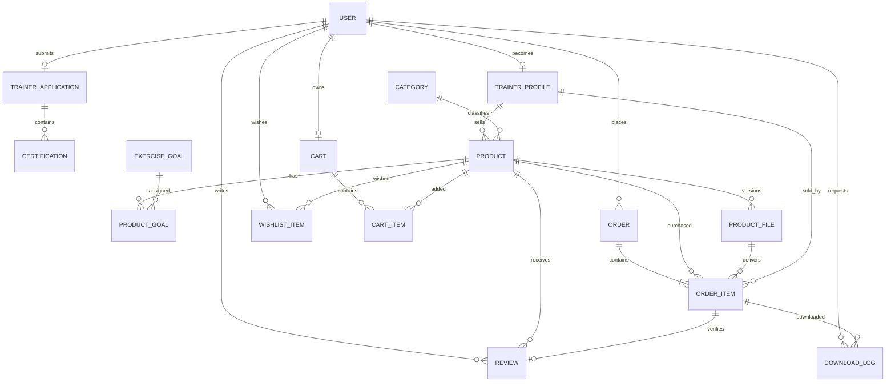

# Routine Market ERD

- 문서 버전: 1.0
- 최종 갱신일: 2026-09-14
- 기준 문서: `docs/requirements-specification.md`
- 대상: Django + PostgreSQL 기반 MVP

## 1. 설계 원칙

- Django 프로젝트 생성 시점부터 커스텀 `User` 모델을 사용한다.
- 트레이너는 별도 로그인 계정이 아니라 `User`에 연결된 `TrainerProfile`로 표현한다.
- 트레이너 신청 정보와 승인 후 공개 프로필을 분리한다.
- 주문 시점의 상품명, 가격, 판매자 정보를 `OrderItem`에 복사하여 이후 변경의 영향을 받지 않도록 한다.
- 구매한 상품 파일의 버전을 `OrderItem`에 저장한다.
- 결제 완료된 `OrderItem`을 다운로드와 리뷰 권한의 기준으로 사용한다.
- 과거 거래와 리뷰의 무결성을 위해 회원, 상품 및 주문은 가급적 물리적으로 삭제하지 않는다.
- 운동 루틴과 자격 증빙의 S3 URL 전체를 저장하지 않고 버킷 내부 `object_key`만 저장한다.

## 2. 전체 관계도



## 3. 테이블 상세

### 3.1 `accounts_user`

Django `AbstractUser`를 확장한 서비스의 기본 사용자 모델이다. 관리자 여부는 Django의 `is_staff`, `is_superuser`를 사용한다.

| 필드 | 타입 | NULL | 제약 및 설명 |
|---|---|:---:|---|
| `id` | BIGINT | X | PK |
| `email` | VARCHAR(254) | X | UNIQUE, 로그인 식별자 |
| `password` | VARCHAR(128) | X | Django 비밀번호 해시 |
| `full_name` | VARCHAR(100) | X | 실명 또는 서비스 표시 이름 |
| `nickname` | VARCHAR(50) | X | UNIQUE |
| `email_verified_at` | TIMESTAMPTZ | O | 회원가입 이메일 인증시각. 이메일 변경 시 초기화 |
| `role` | VARCHAR(20) | X | `MEMBER`, `TRAINER` |
| `is_active` | BOOLEAN | X | 계정 활성 여부 |
| `is_staff` | BOOLEAN | X | 관리자 사이트 접근 여부 |
| `is_superuser` | BOOLEAN | X | 전체 관리자 권한 여부 |
| `date_joined` | TIMESTAMPTZ | X | 가입시각 |
| `last_login` | TIMESTAMPTZ | O | 마지막 로그인 시각 |
| `created_at` | TIMESTAMPTZ | X | 생성시각 |
| `updated_at` | TIMESTAMPTZ | X | 수정시각 |

설계 결정:

- `USERNAME_FIELD = "email"`로 설정하고 기본 `username` 필드는 사용하지 않는다.
- 트레이너 신청 전과 심사 중 사용자의 역할은 `MEMBER`다.
- 신청 승인 트랜잭션에서 `role`을 `TRAINER`로 변경하고 `TrainerProfile`을 생성한다.
- 트레이너도 일반회원의 구매 기능을 모두 사용할 수 있다.

### 3.2 `trainers_trainer_application`

사용자의 현재 트레이너 인증 신청을 저장한다. MVP에서는 사용자당 하나의 신청을 유지하고, 거절 후 내용을 수정하여 재신청한다.

| 필드 | 타입 | NULL | 제약 및 설명 |
|---|---|:---:|---|
| `id` | BIGINT | X | PK |
| `user_id` | BIGINT | X | FK → `accounts_user`, UNIQUE |
| `specialty` | VARCHAR(100) | X | 전문 운동 분야 |
| `career_years` | POSITIVE SMALLINT | X | 경력 연수 |
| `career_description` | TEXT | X | 경력 상세 |
| `introduction` | TEXT | X | 자기소개 |
| `activity_url` | URL | O | 인스타그램 등 공개 활동 URL |
| `status` | VARCHAR(20) | X | `PENDING`, `APPROVED`, `REJECTED` |
| `rejection_reason` | TEXT | O | 거절 사유 |
| `reviewed_by_id` | BIGINT | O | FK → `accounts_user`, 관리자 |
| `submitted_at` | TIMESTAMPTZ | X | 최종 제출시각 |
| `reviewed_at` | TIMESTAMPTZ | O | 최종 심사시각 |
| `created_at` | TIMESTAMPTZ | X | 최초 생성시각 |
| `updated_at` | TIMESTAMPTZ | X | 수정시각 |

제약조건:

- `status = APPROVED`이면 `reviewed_by_id`, `reviewed_at`이 필요하다.
- `status = REJECTED`이면 `rejection_reason`이 필요하다.
- `PENDING` 상태에서는 신청자가 내용을 수정할 수 없도록 서비스 계층에서 제한한다.

### 3.3 `trainers_certification`

트레이너 신청에 첨부된 자격 정보를 저장한다.

| 필드 | 타입 | NULL | 제약 및 설명 |
|---|---|:---:|---|
| `id` | BIGINT | X | PK |
| `application_id` | BIGINT | X | FK → `trainers_trainer_application` |
| `name` | VARCHAR(150) | X | 자격증명 |
| `issuer` | VARCHAR(150) | X | 발급기관 |
| `country_code` | CHAR(2) | X | ISO 국가 코드, 기본 `KR` |
| `credential_number` | VARCHAR(100) | O | 자격번호 |
| `evidence_object_key` | VARCHAR(500) | X | 비공개 S3 객체 키 |
| `original_filename` | VARCHAR(255) | X | 업로드 당시 파일명 |
| `uploaded_at` | TIMESTAMPTZ | X | 업로드 시각 |

### 3.4 `trainers_trainer_profile`

승인된 트레이너에게만 존재하는 공개 판매자 프로필이다.

| 필드 | 타입 | NULL | 제약 및 설명 |
|---|---|:---:|---|
| `id` | BIGINT | X | PK |
| `user_id` | BIGINT | X | FK → `accounts_user`, UNIQUE |
| `specialty` | VARCHAR(100) | X | 대표 전문 분야 |
| `career_years` | POSITIVE SMALLINT | X | 경력 연수 |
| `introduction` | TEXT | X | 공개 자기소개 |
| `activity_url` | URL | O | 공개 활동 URL |
| `is_verified` | BOOLEAN | X | 현재 인증 표시 여부 |
| `verified_at` | TIMESTAMPTZ | X | 승인시각 |
| `created_at` | TIMESTAMPTZ | X | 생성시각 |
| `updated_at` | TIMESTAMPTZ | X | 수정시각 |

`TrainerProfile`에는 공개 가능한 정보만 복사한다. 자격 증빙 원본은 `TrainerApplication`과 `Certification`을 통해 관리자만 확인한다.

### 3.5 `products_category`

| 필드 | 타입 | NULL | 제약 및 설명 |
|---|---|:---:|---|
| `id` | BIGINT | X | PK |
| `name` | VARCHAR(80) | X | UNIQUE, 예: 보디빌딩 |
| `slug` | VARCHAR(100) | X | UNIQUE |
| `description` | TEXT | O | 카테고리 설명 |
| `is_active` | BOOLEAN | X | 검색 조건 노출 여부 |
| `sort_order` | INTEGER | X | 화면 표시 순서 |
| `created_at` | TIMESTAMPTZ | X | 생성시각 |
| `updated_at` | TIMESTAMPTZ | X | 수정시각 |

### 3.6 `products_exercise_goal`

| 필드 | 타입 | NULL | 제약 및 설명 |
|---|---|:---:|---|
| `id` | BIGINT | X | PK |
| `name` | VARCHAR(80) | X | UNIQUE, 예: 근력 향상 |
| `slug` | VARCHAR(100) | X | UNIQUE |
| `is_active` | BOOLEAN | X | 검색 조건 노출 여부 |
| `sort_order` | INTEGER | X | 화면 표시 순서 |

### 3.7 `products_product`

| 필드 | 타입 | NULL | 제약 및 설명 |
|---|---|:---:|---|
| `id` | BIGINT | X | PK |
| `seller_id` | BIGINT | X | FK → `trainers_trainer_profile` |
| `category_id` | BIGINT | X | FK → `products_category` |
| `title` | VARCHAR(200) | X | 상품명 |
| `slug` | VARCHAR(220) | X | UNIQUE, 공개 URL 식별자 |
| `short_description` | VARCHAR(300) | X | 목록용 요약 |
| `description` | TEXT | X | 상세 설명 |
| `difficulty` | VARCHAR(20) | X | `BEGINNER`, `INTERMEDIATE`, `ADVANCED` |
| `duration_weeks` | POSITIVE SMALLINT | X | 프로그램 기간 |
| `sessions_per_week` | POSITIVE SMALLINT | X | 주당 운동 횟수 |
| `price` | POSITIVE INTEGER | X | 원 단위 가격, 0원 허용 |
| `thumbnail_object_key` | VARCHAR(500) | X | 상품 썸네일 객체 키 |
| `status` | VARCHAR(20) | X | `DRAFT`, `PUBLISHED`, `SUSPENDED` |
| `published_at` | TIMESTAMPTZ | O | 최초 공개시각 |
| `created_at` | TIMESTAMPTZ | X | 생성시각 |
| `updated_at` | TIMESTAMPTZ | X | 수정시각 |

검증 규칙:

- `duration_weeks >= 1`
- `1 <= sessions_per_week <= 14`
- `price >= 0`
- 승인되고 활성화된 트레이너만 `PUBLISHED`로 변경할 수 있다.
- 현재 사용 가능한 `ProductFile`이 하나 이상 있어야 공개할 수 있다.

### 3.8 `products_product_goal`

상품과 운동 목적의 다대다 관계를 표현한다.

| 필드 | 타입 | NULL | 제약 및 설명 |
|---|---|:---:|---|
| `id` | BIGINT | X | PK |
| `product_id` | BIGINT | X | FK → `products_product` |
| `goal_id` | BIGINT | X | FK → `products_exercise_goal` |

유일성 제약: `UNIQUE(product_id, goal_id)`

### 3.9 `products_product_file`

운동 루틴 파일 교체와 과거 구매 파일 보존을 위한 버전 테이블이다.

| 필드 | 타입 | NULL | 제약 및 설명 |
|---|---|:---:|---|
| `id` | BIGINT | X | PK |
| `product_id` | BIGINT | X | FK → `products_product` |
| `version` | POSITIVE INTEGER | X | 상품 안에서 증가하는 버전 번호 |
| `object_key` | VARCHAR(500) | X | UNIQUE, 비공개 S3 객체 키 |
| `original_filename` | VARCHAR(255) | X | 업로드 당시 파일명 |
| `content_type` | VARCHAR(100) | X | 검증된 MIME 유형 |
| `size_bytes` | BIGINT | X | 파일 크기 |
| `checksum_sha256` | CHAR(64) | X | 파일 무결성 확인값 |
| `is_current` | BOOLEAN | X | 현재 판매 버전 여부 |
| `created_at` | TIMESTAMPTZ | X | 업로드 시각 |

제약조건:

- `UNIQUE(product_id, version)`
- 상품별 `is_current = TRUE`인 행은 하나만 존재하도록 PostgreSQL 조건부 유일성 제약을 적용한다.
- 과거 `OrderItem`이 참조하는 파일은 삭제하지 않는다.

### 3.10 `products_wishlist_item`

| 필드 | 타입 | NULL | 제약 및 설명 |
|---|---|:---:|---|
| `id` | BIGINT | X | PK |
| `user_id` | BIGINT | X | FK → `accounts_user` |
| `product_id` | BIGINT | X | FK → `products_product` |
| `created_at` | TIMESTAMPTZ | X | 찜한 시각 |

유일성 제약: `UNIQUE(user_id, product_id)`

### 3.11 `orders_cart`

| 필드 | 타입 | NULL | 제약 및 설명 |
|---|---|:---:|---|
| `id` | BIGINT | X | PK |
| `user_id` | BIGINT | X | FK → `accounts_user`, UNIQUE |
| `created_at` | TIMESTAMPTZ | X | 생성시각 |
| `updated_at` | TIMESTAMPTZ | X | 수정시각 |

### 3.12 `orders_cart_item`

디지털 상품이므로 수량 필드는 두지 않고 한 상품을 한 번만 담는다.

| 필드 | 타입 | NULL | 제약 및 설명 |
|---|---|:---:|---|
| `id` | BIGINT | X | PK |
| `cart_id` | BIGINT | X | FK → `orders_cart` |
| `product_id` | BIGINT | X | FK → `products_product` |
| `created_at` | TIMESTAMPTZ | X | 추가시각 |

유일성 제약: `UNIQUE(cart_id, product_id)`

### 3.13 `orders_order`

| 필드 | 타입 | NULL | 제약 및 설명 |
|---|---|:---:|---|
| `id` | BIGINT | X | PK |
| `order_number` | UUID | X | UNIQUE, 외부 노출용 주문번호 |
| `buyer_id` | BIGINT | X | FK → `accounts_user` |
| `status` | VARCHAR(20) | X | `PENDING`, `PAID`, `CANCELLED` |
| `total_amount` | POSITIVE INTEGER | X | 주문 금액 합계 |
| `paid_at` | TIMESTAMPTZ | O | 가상 결제 완료시각 |
| `cancelled_at` | TIMESTAMPTZ | O | 결제 전 취소시각 |
| `created_at` | TIMESTAMPTZ | X | 주문 생성시각 |
| `updated_at` | TIMESTAMPTZ | X | 수정시각 |

제약조건:

- `status = PAID`이면 `paid_at`이 필요하다.
- `status = CANCELLED`이면 `cancelled_at`이 필요하다.
- `total_amount`는 `OrderItem.unit_price` 합계와 일치해야 하며 서비스 계층에서 계산한다.

### 3.14 `orders_order_item`

| 필드 | 타입 | NULL | 제약 및 설명 |
|---|---|:---:|---|
| `id` | BIGINT | X | PK |
| `order_id` | BIGINT | X | FK → `orders_order` |
| `product_id` | BIGINT | X | FK → `products_product`, PROTECT |
| `product_file_id` | BIGINT | X | FK → `products_product_file`, PROTECT |
| `seller_id` | BIGINT | X | FK → `trainers_trainer_profile`, PROTECT |
| `product_title` | VARCHAR(200) | X | 주문 당시 상품명 스냅샷 |
| `seller_name` | VARCHAR(100) | X | 주문 당시 판매자명 스냅샷 |
| `unit_price` | POSITIVE INTEGER | X | 주문 당시 가격 |
| `created_at` | TIMESTAMPTZ | X | 생성시각 |

제약조건:

- `UNIQUE(order_id, product_id)`
- 주문 생성 시점에 현재 `ProductFile`을 연결한다.
- 본인 상품 구매와 이미 결제 완료된 상품의 중복 구매는 서비스 계층에서 차단한다.
- 리뷰와 다운로드 권한은 `order.status = PAID`인 경우에만 부여한다.

### 3.15 `reviews_review`

| 필드 | 타입 | NULL | 제약 및 설명 |
|---|---|:---:|---|
| `id` | BIGINT | X | PK |
| `author_id` | BIGINT | X | FK → `accounts_user` |
| `product_id` | BIGINT | X | FK → `products_product` |
| `order_item_id` | BIGINT | X | FK → `orders_order_item`, UNIQUE |
| `rating` | POSITIVE SMALLINT | X | 1~5점 |
| `content` | TEXT | X | 리뷰 내용 |
| `is_visible` | BOOLEAN | X | 공개 여부 |
| `created_at` | TIMESTAMPTZ | X | 생성시각 |
| `updated_at` | TIMESTAMPTZ | X | 수정시각 |

제약조건:

- `UNIQUE(author_id, product_id)`
- `CHECK(1 <= rating AND rating <= 5)`
- `order_item`의 구매자와 `author`가 일치해야 한다.
- `order_item.product`와 `product`가 일치해야 한다.
- 연결된 주문 상태가 `PAID`여야 한다.

마지막 세 조건은 모델 및 서비스 계층에서 검증한다.

### 3.16 `orders_download_log`

서명 URL 자체는 저장하지 않고 다운로드 권한 발급 사실만 기록한다.

| 필드 | 타입 | NULL | 제약 및 설명 |
|---|---|:---:|---|
| `id` | BIGINT | X | PK |
| `user_id` | BIGINT | X | FK → `accounts_user` |
| `order_item_id` | BIGINT | X | FK → `orders_order_item` |
| `ip_address` | INET | O | 요청 IP |
| `user_agent` | VARCHAR(500) | O | 요청 브라우저 정보 |
| `created_at` | TIMESTAMPTZ | X | URL 발급시각 |

## 4. 핵심 처리 흐름

### 4.1 트레이너 승인

하나의 데이터베이스 트랜잭션에서 다음 작업을 수행한다.

1. `TrainerApplication` 행을 잠근다.
2. 현재 상태가 `PENDING`인지 확인한다.
3. 상태를 `APPROVED`로 변경하고 처리자와 처리시각을 기록한다.
4. `TrainerProfile`을 생성한다.
5. `User.role`을 `TRAINER`로 변경한다.

### 4.2 주문 생성

1. 구매자의 장바구니 항목을 조회한다.
2. 각 상품의 상태, 판매자 승인 상태, 중복 구매 및 본인 상품 여부를 다시 확인한다.
3. `Order`를 `PENDING` 상태로 생성한다.
4. 상품명, 가격, 판매자와 현재 파일 버전을 복사하여 `OrderItem`을 생성한다.
5. 서버에서 계산한 항목 가격의 합을 `Order.total_amount`에 저장한다.

상품 가격은 브라우저가 전송한 값을 사용하지 않는다.

### 4.3 가상 결제 완료

1. `Order` 행을 `select_for_update()`로 잠근다.
2. 요청자가 구매자인지 확인한다.
3. 주문 상태가 `PENDING`인지 확인한다.
4. 상태를 `PAID`로 변경하고 `paid_at`을 기록한다.
5. 주문된 상품을 장바구니에서 제거한다.

판매량과 매출은 별도 누적 필드에 저장하지 않고 `PAID` 주문 항목을 집계한다. 따라서 결제 요청이 반복되어도 판매 통계가 중복 증가하지 않는다.

### 4.4 다운로드 권한 확인

1. 요청자가 로그인했는지 확인한다.
2. `OrderItem.order.buyer`가 요청자와 일치하는지 확인한다.
3. 주문 상태가 `PAID`인지 확인한다.
4. 주문 항목이 참조하는 `ProductFile.object_key`로 짧은 만료시간의 S3 서명 URL을 생성한다.
5. `DownloadLog`를 저장하고 브라우저를 서명 URL로 이동시킨다.

## 5. 삭제 정책

| 대상 | 정책 | 이유 |
|---|---|---|
| 사용자 | `is_active=False` | 과거 주문과 리뷰 보존 |
| 트레이너 프로필 | 비활성 처리 | 판매 이력 보존 |
| 트레이너 신청 | 물리 삭제 금지 | 심사 기록 보존 |
| 상품 | `SUSPENDED` 처리 | 주문과 리뷰 참조 보존 |
| 상품 파일 | 참조 주문이 없을 때만 삭제 | 구매 파일 보존 |
| 카테고리·운동 목적 | `is_active=False` | 기존 상품 분류 보존 |
| 주문·주문 항목 | 물리 삭제 금지 | 거래 기록 보존 |
| 리뷰 | `is_visible=False` 우선 | 관리 및 감사 가능성 보존 |
| 장바구니·찜 | 실제 삭제 허용 | 거래 이력이 아님 |
| 다운로드 로그 | 보존 기간 후 삭제 가능 | 로그 데이터 증가 제어 |

권장 Django `on_delete` 정책:

- 거래와 콘텐츠의 핵심 관계: `PROTECT`
- 장바구니, 찜, 신청의 하위 첨부: `CASCADE`
- 선택적인 관리자 참조: `SET_NULL`

## 6. 인덱스

PostgreSQL과 Django ORM에서 다음 인덱스를 우선 적용한다.

| 테이블 | 인덱스 필드 | 목적 |
|---|---|---|
| `accounts_user` | `email` UNIQUE | 로그인 및 중복 확인 |
| `trainers_trainer_application` | `status`, `submitted_at` | 관리자 심사 목록 |
| `products_product` | `status`, `created_at` | 공개 최신 상품 목록 |
| `products_product` | `category_id`, `difficulty`, `price` | 상품 필터 |
| `products_product` | `seller_id`, `status` | 판매자 상품 관리 |
| `products_product_goal` | `goal_id`, `product_id` | 목적별 필터 |
| `orders_order` | `buyer_id`, `created_at` | 구매 내역 |
| `orders_order` | `status`, `paid_at` | 결제·매출 집계 |
| `orders_order_item` | `seller_id`, `created_at` | 판매 현황 집계 |
| `reviews_review` | `product_id`, `is_visible` | 상품 리뷰와 평점 |
| `orders_download_log` | `user_id`, `created_at` | 사용자별 다운로드 기록 |

초기에는 PostgreSQL의 기본 검색으로 구현한다. 상품 수가 늘어난 뒤 필요하면 `title`, `short_description`, `description`에 전문 검색 인덱스를 추가한다.

## 7. Django 앱별 모델 배치

```text
accounts
└── User

trainers
├── TrainerApplication
├── Certification
└── TrainerProfile

products
├── Category
├── ExerciseGoal
├── Product
├── ProductGoal
├── ProductFile
└── WishlistItem

orders
├── Cart
├── CartItem
├── Order
├── OrderItem
└── DownloadLog

reviews
└── Review
```

## 8. 구현에 반영된 설계 결정

요구사항 명세서의 설계 선택지를 구현하면서 다음 기준으로 확정했다.

1. 모든 사용자는 일반회원으로 가입한 뒤 트레이너 전환을 신청한다.
2. 한 주문에 여러 판매자의 상품을 담을 수 있다.
3. 이미 결제 완료한 디지털 상품은 다시 구매할 수 없다.
4. 상품 파일은 버전으로 보존하며 구매자는 주문 당시 파일 버전을 받는다.
5. 0원 상품을 허용한다.
6. 회원 탈퇴는 비활성화로 처리하고 거래 기록은 보존한다.
7. 판매 건수와 가상 매출은 `PAID` 주문에서 계산한다.
8. 상품과 리뷰는 물리 삭제보다 상태 변경을 우선한다.

위 결정은 현재 Django 모델과 서비스 로직에 반영되어 있다. 변경 시 모델·마이그레이션·테스트와 본 문서를 함께 갱신한다.

## 9. 구현 상태와 후속 검토

본 ERD의 엔티티·관계·핵심 제약은 구현 완료되었다. 회원 기본정보 및 트레이너 공개 프로필 수정은 기존 테이블의 `updated_at`을 사용하므로 별도 엔티티가 필요하지 않다. 후속 검토 대상은 계정 비활성화 이력, 관리자 상품 상태 변경 감사 로그, 파일 보존·삭제 정책을 위한 감사 엔티티 도입 여부다.
